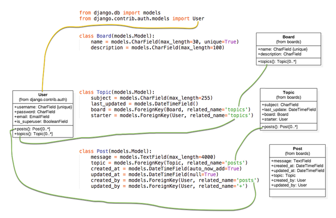
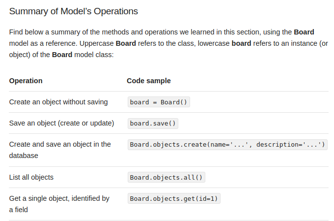
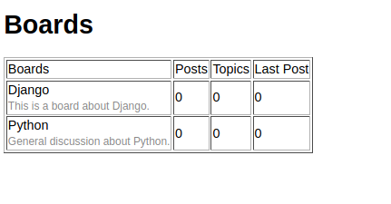

# Simproject

This Simproject is based on SIMPLEisBETTERthanCOMPLEX
written by Vitor Freitas


### 1- Initial commands
- PycharmProjects $ mkdir simproject
- simproject $ virtualenv .venv -p python3.8
- simproject $ source .venv/bin/activate
- (venv) simproject $ pipenv install django
- (.venv) simproject $ django-admin startproject myproject .
- (.venv) simproject $ django-admin startapp boards
    
### 2- Insert in the file setting.py -> INSTALLED_APPS
- file setting.py -> INSTALLED_APPS -> 'boards',
- Views.py 
  - Views are python functions that receives -> HttpRequest objects and returns HttpResponse
```
from django.http import HttpResponse
def home(request):
    return HttpResponse('Hello.World!!!')
```  
- myproject/urls.py
  - from boards import views
  - path('', views.home, name='home'),

### 3- Git and GitHub -> cmds to execute in the terminal
- git init
- git status
- git add -A   # --all
- git commit -m 'initial commit'
- git remote add origin https://github.com/jlplautz/simproject.git
- Over on GitHub creat a new repo -> simproject -> Public
- (.venv) simproject $ git push -u origin master


### 4- Implemented the models.py file

```
(.venv) simproject $ mng makemigrations
(.venv) simproject $ mng sqlmigrate boards 0001
BEGIN;
--
-- Create model Board
--
CREATE TABLE "boards_board" ("id" integer NOT NULL PRIMARY KEY AUTOINCREMENT, "name" varchar(30) NOT NULL UNIQUE, "description" varchar(100) NOT NULL);
--
-- Create model Topic
--
CREATE TABLE "boards_topic" ("id" integer NOT NULL PRIMARY KEY AUTOINCREMENT, "subject" varchar(255) NOT NULL, "last_updated" datetime NOT NULL, "board_id" integer NOT NULL REFERENCES "boards_board" ("id") DEFERRABLE INITIALLY DEFERRED, "starter_id" integer NOT NULL REFERENCES "auth_user" ("id") DEFERRABLE INITIALLY DEFERRED);
--
-- Create model Post
--
CREATE TABLE "boards_post" ("id" integer NOT NULL PRIMARY KEY AUTOINCREMENT, "message" text NOT NULL, "created_at" datetime NOT NULL, "updated_at" datetime NULL, "created_by_id" integer NOT NULL REFERENCES "auth_user" ("id") DEFERRABLE INITIALLY DEFERRED, "topic_id" integer NOT NULL REFERENCES "boards_topic" ("id") DEFERRABLE INITIALLY DEFERRED, "updated_by_id" integer NULL REFERENCES "auth_user" ("id") DEFERRABLE INITIALLY DEFERRED);
CREATE INDEX "boards_topic_board_id_4462fe82" ON "boards_topic" ("board_id");
CREATE INDEX "boards_topic_starter_id_60e98681" ON "boards_topic" ("starter_id");
CREATE INDEX "boards_post_created_by_id_0b841038" ON "boards_post" ("created_by_id");
CREATE INDEX "boards_post_topic_id_f477c024" ON "boards_post" ("topic_id");
CREATE INDEX "boards_post_updated_by_id_76d3c48f" ON "boards_post" ("updated_by_id");
COMMIT;
```

(.venv) simproject $ python manage.py migrate

(.venv) simproject $ python shell

```
>>> from boards.models import Board
>>> board = Board(name='Django', description='This is a board about Django.')
>>> board.save()
>>> board.id
1
>>> board.name
'Django'
>>> board.description
'This is a board about Django.'
>>> board.description
'This is a board about Django.'
>>> board.description = 'Django discussion board'
>>> board.save()
>>> board = Board.objects.create(name='Python', description='General discussion about Python.')
>>> board.id
2
>>> board.name 
'Python'
>>> Board.objects.all()
<QuerySet [<Board: Board object (1)>, <Board: Board object (2)>]>

>>> boards_list = Board.objects.all()
>>> for board in boards_list:
...     print(board.description)
... 
Django discussion board
General discussion about Python.

>>> django_board = Board.objects.get(id=1)
>>> django_board.name
'Django'

>>> board = Board.objects.get(id=3)
boards.models.Board.DoesNotExist: Board matching query does not exist.

>>> Board.objects.get(name='Django')
<Board: Django>
```



### 5- Views, templates and Static Files
   - file settings.py
      - 'DIRS': [os.path.join(BASE_DIR, 'templates')],
```
>>> from django.conf import settings
>>> settings.BASE_DIR
PosixPath('/home/plautz/PycharmProjects/simproject')
>>> import os
>>> os.path.join(settings.BASE_DIR, 'templates')
'/home/plautz/PycharmProjects/simproject/templates'
```  
  - views.py
```
def home(request):
    boards = Board.objects.all()
    return render(request, 'home.html', {'boards': boards})
```

  - home.html page

    
  - boards/tests.py
```
class HomeTests(TestCase):
    def test_home_view_status_code(self):
        url = reverse('home')
        response = self.client.get(url)
        self.assertEquals(response.status_code, 200)
```
  - mng test -> -v {0,1,2,3}, --verbosity {0,1,2,3}
     - Verbosity level; 0=minimal output, 1=normal output, 2=verbose output, 3=very verbose output
